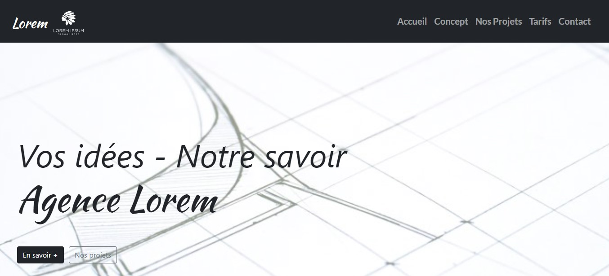
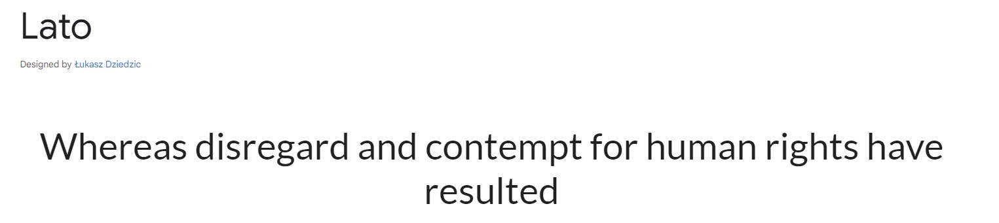
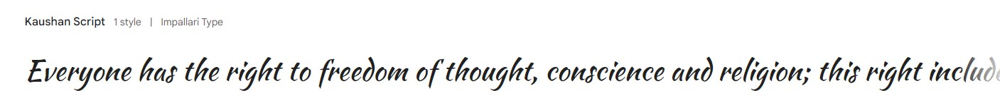

# Entraînement Projet 3 - Utilisation de Bootstrap 

## Technologies utilisées

## Table des matières

- [Aperçu](#aperçu)
- [Fonctionnalités](#fonctionnalités)
- [Prérequis](#prérequis)
- [Installation](#installation)
- [Palette de Couleurs](#palette-de-couleurs)
- [Typographie](#typographie)

## Aperçu

## Fonctionnalités

- Mise en page réactive avec Bootstrap v.5

## Prérequis

- Un serveur web local (ex : [Live Server](https://marketplace.visualstudio.com/items?itemName=ritwickdey.LiveServer) pour Visual Studio Code)
- Un navigateur 

## Installation

1. Clonez le dépôt sur votre machine locale : [Cliquez ici](git@github.com:pascalinecte91/Lorem-ipsum-bootstrap.git)
2. Ouvrez le projet dans votre éditeur de code.

## Typographie

- librairie  Ekko

Ce projet utilise les deux polices suivantes :

1. **lato**
   - **Styles disponibles**: 100, 200, 300, 400, 500, 600, 700, 800, 900
   - **Police**: [Lato sur Google Fonts](https://fonts.google.com/specimen/Lato)

2. **Kaushan Script**
   - **Styles disponibles**: Regular
   - **Police**: [Kaushan Script sur Google Fonts](https://fonts.google.com/specimen/Kaushan+Script)

### Exemples de texte

### Lato: 

### Kaushan-script:

